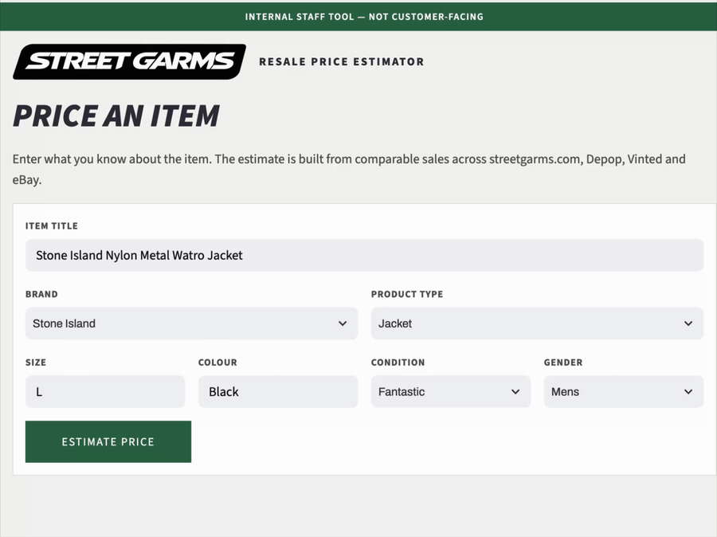

# Street Garms Item Price Estimator


**Gradient-boosted price engine, trained across four sales channels and served with calibrated confidence**

**The Problem:** Street Garms lists thousands of one-of-a-kind second-hand items a year, each priced by hand. Manual pricing is slow, inconsistent between staff and sub-optimal pricing directly erodes margin — underprice and you give away profit, overprice and stock sits dead. 

**The Solution:** An end-to-end gradient-boosted ML system that predicts what an item will sell for, trained on ~8,000 real sales spanning four sales channels — Shopify, eBay, Vinted and Depop — unified into one schema and shipped as a staff-facing web app that returns a price, a calibrated confidence range and comparable recent sales.



---

## Model comparison

Five models were evaluated to find the best price predictor for Street Garms, from a naive baseline to tuned gradient boosting. Every model ran through **identical preprocessing and the same honest time-based split** (train on the past, test on the future), isolating the model as the sole variable. Target is `log(sold_price)`; error is reported as **median / mean absolute percentage error** and RMSE in log space.

| Model | RMSE(log) | MAPE | **Median APE** |
|---|---|---|---|
| Naive (median) | 0.507 | 33.8% | 29.7% |
| Ridge (linear baseline) | 0.237 | 15.9% | 11.3% |
| RandomForest | 0.233 | 15.8% | 10.9% |
| XGBoost | 0.231 | 15.3% | 10.7% |
| **HistGradientBoosting** | **0.220** | **14.7%** | **10.5%** |

**The finding is the clustering.** The four real models sit within ~1 point of each other — and across repeated random splits that gap is inside the ±0.9% noise band. On this problem, **model choice is not the lever; the feature set is.** A tuned XGBoost, despite the hype, does not beat sklearn's `HistGradientBoosting`, which was selected on accuracy with no extra dependency. The gradient booster more than halves the naive baseline's error.

---

## Pipeline & architecture

```
Shopify API (Shopify + eBay orders)  ┐
Vinted export                        ├──▶  clean per source  ──▶  combine  ──▶  features  ──▶  HistGradientBoosting (+ conformal band)  ──▶  Streamlit app
Depop JSON export                    ┘
```

Three exports feed the pipeline — the Shopify Admin API (carrying the shop's **Shopify and eBay** orders), a Vinted CSV, and Depop's nested JSON export. Each is a completely different shape, cleaned by a **deterministic, row-wise** step into one shared schema and tagged with a `platform` feature so the model can learn cross-channel price differences; the feature encoders are then **fit on the training split only** to prevent leakage. (eBay sales come *through* the Shopify pull, so they share its `platform` tag rather than forming a separate source.)

### Stack

**ML / data:** Python · pandas · scikit-learn (`HistGradientBoostingRegressor`, `ColumnTransformer`, `OneHotEncoder`, `CountVectorizer`) · XGBoost · conformal prediction · joblib
**Serving:** Streamlit staff app · model persisted as a bundle (`pipeline` + calibration factor) · runs locally to keep sales data off public infra
**Sources:** Shopify GraphQL Admin API (Shopify and eBay orders) · Vinted export · Depop data export

---

## Confidence without a native score: research limitation → shipped feature

A gradient-boosted regressor outputs a single number — **no native uncertainty**. So out of the box the tool can't tell staff *when to trust it*, which is exactly what turns a demo into something usable.

The production build solved it two ways:
- **Calibrated intervals via conformal prediction** — the 90% price range is derived from the model's own held-out residuals and persisted alongside the model as a single multiplicative factor, so the app shows an honest range, not a false-precision point.
- **A "not enough comps to price" state** — when too few comparable sales exist for an item, the app *refuses to guess* and routes it to manual pricing.

Together these restore the human-in-the-loop workflow that error analysis (below) showed was essential — surfacing uncertainty exactly where human judgement is cheap and valuable.

---

## Hard problems solved along the way

- **Data leakage that would have faked the accuracy** — `list_price` ≈ `sold_price` (items sell at list), so feeding it in makes the model "predict the price from the price" — and useless at listing time, when no price exists yet. Caught and excluded (along with days-on-market and post-sale tags) via an explicit *"is this known at listing time?"* test, before it inflated the benchmark.
- **Mixed-timezone timestamps across sources** — Depop's microsecond ISO timestamps vs Shopify/Vinted's date-only values silently defeated `read_csv` date parsing, turning the split column into strings and crashing the time split. Fixed with explicit mixed-format parsing.
- **A sparse-matrix bug that only appeared at scale** — the one-hot + text feature matrix stayed dense on ~2k rows but crossed scikit-learn's sparsity threshold once Depop's ~5k rows grew the token vocabulary, breaking the booster. Reproduced and fixed by forcing dense output.
- **`product_type` fragmentation silently splitting the #1 feature** — Shopify's raw field (`T-Shirt`, `Pants`) vs the canonical parse (`tshirt`, `trousers`) vs Vinted/Depop values meant the same garment landed in different categories, diluting the single strongest predictor. Fixed with one central canonicalisation step.

---

## Deliberate tradeoffs

- **`HistGradientBoosting` over XGBoost** — both were benchmarked (XGBoost even hyperparameter-tuned); HGB won on the honest time-split with no extra dependency. Evidence over hype.
- **Time-based split over random k-fold** — prices drift ~25–30% a year, so a random split leaks future price levels and flatters the score. Chose the eval that matches deployment.
- **Streamlit over Flask** — for an internal tool, build speed beat pixel-perfect control (the opposite call to Street Garms' customer-adjacent classifier project — a deliberate, context-driven choice, not a default).

---

## Scientific rigour

- **Time-based split** (train past / test future) — matches how the model is actually used and exposes price drift a random split would hide.
- **Leakage handling** — every candidate feature passed a *"known at listing time?"* test; `list_price` (circular), days-on-market and post-sale tags were excluded on principle, not by accident.
- **Target & metric chosen from the data** — `log(sold_price)` (raw skew 1.22 → −0.51 after log) with percentage-error metrics (median APE / RMSLE) rather than raw RMSE, so cheap tees and expensive outerwear are weighted fairly.
- **Feature selection by permutation importance** — *removing* noise features (parsed garment measurements, release-year) actually *improved* test accuracy. `product_type`, brand and condition carry the signal.
- **Learning curve** to diagnose data- vs feature-limited — still descending, so more/richer data is worth pursuing.
- **Honest negative results** — added Depop data was within noise, title bigrams didn't help, and brand-from-title was redundant with the token features. Reported, not buried.

---

## Error analysis

The model's errors concentrate in a clear pattern: an **over-prediction tail**. Items that look premium on paper — right brand, type and condition — but sold cheap, because the features can't see *item-specific desirability*: a common piece and a sought-after archival grail with identical attributes are indistinguishable to the model.

This is the coarse-feature ceiling, and it directly motivated the confidence + manual-review design — the model's uncertainty is highest exactly where a human's product knowledge adds the most, so that's where the system hands off.

---

## Repo structure

```
├── src/streetgarms_pricing/
│   ├── data/         # per-source cleaners (Shopify / Vinted / Depop) + combine + Shopify extractor
│   ├── features/     # leakage-safe feature pipeline (encoders fit on train only)
│   ├── models/       # time split · metrics · benchmark bake-off · train · predict
│   └── app.py        # branded Streamlit pricing app
├── notebooks/        # exploratory data analysis
├── assets/           # logo / demo (gif)
├── data/             # raw · interim · processed   (gitignored — proprietary sales data)
├── models/           # persisted model bundle       (gitignored)
└── tests/            # unit tests for the deterministic transforms (roadmap)
```

> **Note:** this is a sanitised version. The sales data from Shopify, eBay, Vinted and Depop is commercial and excluded (gitignored); the trained model artifact is not distributed.

---

*Built solo as CTO & Co-Owner at [Street Garms](https://streetgarms.com). Questions welcome — [LinkedIn](https://www.linkedin.com/in/matthall-ai) · matt@nomadicdigital.co.uk*